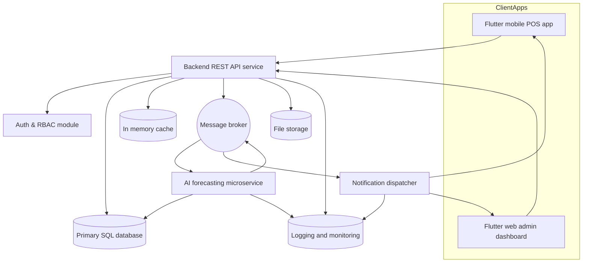
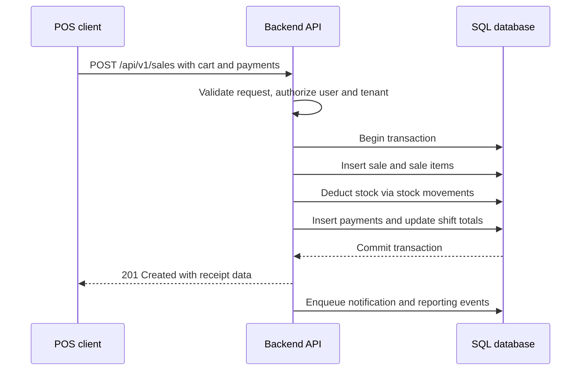
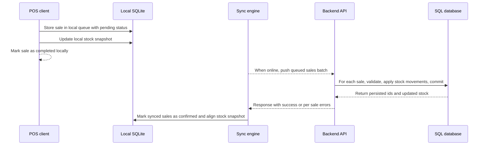

# EasyPOS System Architecture

## 1. Overview

EasyPOS is a multi-tenant, multi-vendor Point of Sale and Inventory Management platform targeting mobile (Flutter) and web (Flutter Web) clients, with a modular backend and optional AI forecasting microservice.

The architecture follows a service-oriented, clean architecture style with clear separation between:

- Client apps (POS terminals, management dashboards)
- Backend API service
- AI forecasting service
- Notification service
- Shared infrastructure (database, message broker, cache, object storage, monitoring)

## 2. High-Level Component Diagram

## 3. Logical Backend Modules

The backend is organized by bounded contexts and follows clean architecture layering:

- Core domains:
  - Auth and RBAC
  - Tenants and Vendors
  - Branches and Warehouses
  - Catalog (products, categories, units, pricing)
  - Inventory and Stock Movements
  - Purchasing (suppliers, purchase orders, shipments)
  - Sales and POS
  - Returns and Adjustments
  - Commissions
  - Reporting and Analytics
  - Notifications
  - Audit logging
- Cross cutting concerns:
  - Authentication and authorization
  - Multi tenant scoping
  - Validation
  - Caching
  - Logging and monitoring

Each domain module exposes:

- Domain layer (entities, value objects, domain services)
- Application layer (use cases, commands and queries)
- Infrastructure layer (ORM models, repositories, integrations)
- Interface layer (HTTP controllers, serializers)

## 4. Multi Tenant and Multi Vendor Model

- The system is designed as multi tenant where each tenant represents a business or group of vendors.
- Each vendor can operate multiple branches and warehouses within a tenant.
- All requests are scoped by tenant and vendor based on JWT claims and enforced in repository queries.

Key principles:

- Every business entity table includes tenant_id and often vendor_id and branch_id.
- All queries are filtered by tenant_id, and by vendor_id or branch_id where applicable.
- Admin roles at platform level are separated from tenant admin roles.

## 5. Data Flow Examples

### 5.1 POS Sale Online Flow

### 5.2 POS Sale Offline and Sync Flow

## 6. Technology Choices

Backend:

- Language and framework: choose one primary stack such as:
  - [`Node.js.express()`](backend/express_app.ts:1)
  - [`Python.fastapi()`](backend/fastapi_app.py:1)
  - [`Laravel.php()`](backend/laravel_routes.php:1)
- Database access with an ORM or query builder that supports migrations and multi tenant scoping.

Data storage:

- Primary SQL database (PostgreSQL or MySQL).
- Optional Redis or similar for caching session data and frequently read entities.
- Object storage for receipts, exports, or attachments.

Messaging:

- Lightweight message broker such as RabbitMQ or Kafka or a managed queue service to decouple long running tasks (notifications, AI forecasting jobs, heavy reporting).

Monitoring:

- Centralized logging, error tracking, and basic metrics for all services.

## 7. Frontend Logical Architecture

Clients:

- Flutter mobile app for POS terminals and light management.
- Flutter web app for admin dashboards and reporting.

Both apps share:

- A core layer for theme, networking, error handling, and auth.
- Feature modules for:
  - Auth
  - POS
  - Inventory
  - Vendors and branches
  - Purchasing
  - Reports
  - Settings and user management

Offline strategy for POS:

- Use local SQLite via [`sqflite.Database()`](lib/core/local_db.dart:5) or equivalent.
- Maintain local caches for:
  - Products and pricing
  - Branch stock snapshots
  - Open shifts and unsynced sales
- Sync engine handles background upload and download when connectivity is available.

## 8. Security and RBAC Overview

- Authentication via JWT with claims for user_id, tenant_id, vendor_id or branch context, roles, and permissions version.
- Role based access control with tables for roles, permissions, and assignments.
- Critical operations such as price changes, stock adjustments, and refunds require explicit permissions and are fully audited.
- All data access must be scoped by tenant_id and only elevated platform admins can cross tenant boundaries.

## 9. Extensibility and Phased Delivery

- Start with a monolithic backend service with modular architecture and clear domain boundaries.
- Keep infrastructure ready to split out:
  - AI forecasting into its own microservice.
  - Notifications into a dedicated worker.
  - Reporting into separate read optimized stores if needed.
- Design the schema, APIs, and message contracts so that future extraction to microservices does not break clients.