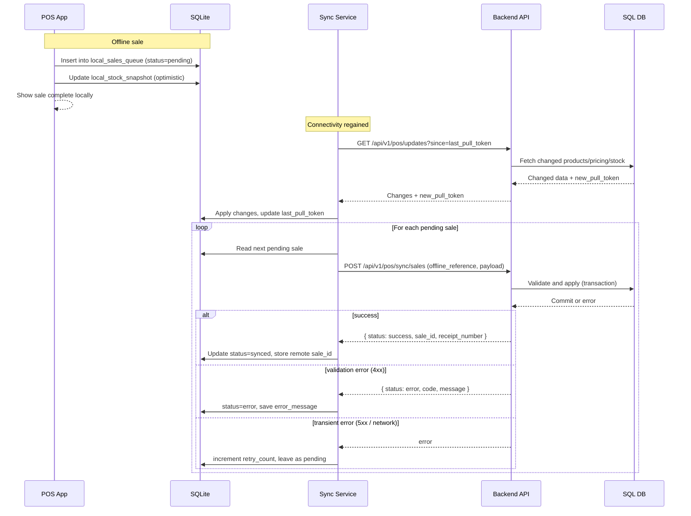

# EasyPOS Architecture Review & Refinements

This document does **not** replace the existing design. It records **improvements and refinements** on top of:

- Base architecture: [`ARCHITECTURE.md`](ARCHITECTURE.md:1)
- Backend spec: [`BACKEND_SPEC.md`](BACKEND_SPEC.md:1)
- Database schema: [`DB_SCHEMA.md`](DB_SCHEMA.md:1)
- Overview: [`EASY_POS_OVERVIEW.md`](EASY_POS_OVERVIEW.md:1)

It focuses on:

1. Stricter Clean Architecture for backend  
2. Flutter MVVM + Clean Architecture on frontend  
3. Stronger offline POS flows  
4. Stronger RBAC and permission model  
5. DB design optimizations (only deltas)  
6. Scalability and performance refinements  

---

## 1. Backend – Enforcing Clean Architecture

### 1.1 Dependency Direction

The current layering in [`BACKEND_SPEC.md`](BACKEND_SPEC.md:21) is correct, but we refine **dependency rules**:

- Domain layer:
  - Depends on **nothing** (no framework, no DB).
  - Owns entities, value objects, domain services, basic interfaces.
- Application layer:
  - Depends **only on Domain**.
  - Contains use cases (commands/queries), DTOs, orchestrates domain rules.
  - Defines **repository interfaces** and **service ports** (e.g. NotificationPort, ForecastingPort).
- Infrastructure layer:
  - Depends on **Application and Domain**, never the other way.
  - Contains ORM models, concrete repositories, external adapters (HTTP, message broker, AI).
- Presentation layer:
  - Depends on **Application layer** only.
  - Exposes controllers/routes, HTTP adapters, request/response mappers, middleware.

Refined dependency diagram:

```mermaid
graph TD
  subgraph Domain
    DEntities[Domain Entities]
    DServices[Domain Services]
    DInterfaces[Domain Interfaces (Repository Ports)]
  end

  subgraph Application
    UseCases[Use Cases]
    DTOs[DTOs / Input Models]
    Ports[Service Ports (Notifications, AI, etc.)]
  end

  subgraph Infrastructure
    ORM[ORM Models]
    RepoImpl[Repository Implementations]
    Adapters[External Adapters (AI, Message Broker)]
  end

  subgraph Presentation
    Controllers[HTTP Controllers]
    Middleware[Auth / RBAC Middleware]
  end

  DEntities -->|used by| UseCases
  DServices -->|used by| UseCases
  DInterfaces -->|implemented by| RepoImpl

  UseCases -->|calls| DInterfaces
  UseCases -->|calls| Ports

  Controllers -->|invoke| UseCases
  Middleware -->|checks| UseCases

  RepoImpl -->|uses| ORM
  Adapters -->|call| External[External Services]

  classDef readonly fill=#f5f5f5,stroke=#333,stroke-width=1px;
  class Domain,Application,Infrastructure,Presentation readonly;
```

Key strengthening:

- **No controller directly touches ORM**.
- **No domain entity imports any framework classes**.
- Repositories + ports are **interfaces in Application**, implemented in Infrastructure.

### 1.2 Module Folder Refinement

Refine the sketch in [`BACKEND_SPEC.md`](BACKEND_SPEC.md:842) to be more explicit per module:

```text
backend/
  src/
    domain/
      inventory/
        entities/
          Stock.ts
          StockMovement.ts
        services/
          StockDomainService.ts
    application/
      inventory/
        use_cases/
          AdjustStockUseCase.ts
          GetStockLevelsQuery.ts
        ports/
          InventoryRepository.ts
        dto/
          AdjustStockDto.ts
    infrastructure/
      inventory/
        orm/
          StockModel.ts
          StockMovementModel.ts
        repositories/
          InventoryRepositoryImpl.ts
    presentation/
      inventory/
        http/
          InventoryController.ts
          InventoryRoutes.ts
```

Same pattern applies to `pos_sales`, `purchasing`, `catalog`, etc.

---

## 2. Flutter – MVVM + Clean Architecture

The current frontend section in [`ARCHITECTURE.md`](ARCHITECTURE.md:166) is logical but not strict. We refine:

### 2.1 Layers and Responsibilities

- Presentation Layer:
  - **Screens** (pages)
  - **Widgets** (UI components)
  - **ViewModels** (state + UI-facing actions)
- Domain Layer:
  - Entities (pure Dart models used in business logic)
  - UseCases (single-purpose business interactions)
  - Repository interfaces (abstract contracts)
- Data Layer:
  - Remote data sources (REST calls to backend)
  - Local data sources (SQLite for POS offline)
  - Repository implementations (bridge Domain ↔ Data)

Recommended state management: **Bloc/Cubit** or **Riverpod**.  
For complex flows and better testing, pick **Bloc + freezed** or **Riverpod** with `StateNotifier`.

### 2.2 Feature-based Folder Structure (Flutter)

Refinement for `lib/`:

```text
lib/
  core/
    network/
      api_client.dart
    db/
      local_db.dart          // wraps sqflite.Database()
    di/
      service_locator.dart   // e.g. get_it or Riverpod providers
    error/
      failures.dart
    utils/
      date_time_utils.dart
  features/
    pos/
      presentation/
        screens/
          pos_screen.dart
          payment_screen.dart
        widgets/
          cart_item_tile.dart
          sync_status_banner.dart
        viewmodels/
          pos_viewmodel.dart     // or bloc/cubit
          sync_viewmodel.dart
      domain/
        entities/
          sale.dart
          sale_item.dart
          payment.dart
        usecases/
          create_sale_usecase.dart
          sync_offline_sales_usecase.dart
        repositories/
          pos_repository.dart    // abstract
      data/
        models/
          sale_model.dart
          sale_item_model.dart
        datasources/
          pos_remote_data_source.dart
          pos_local_data_source.dart   // SQLite
        repositories/
          pos_repository_impl.dart
    inventory/
      presentation/...
      domain/...
      data/...
    auth/
      ...
    purchasing/
      ...
    reports/
      ...
```

### 2.3 Dependency Direction (Flutter)

```mermaid
graph TD
  subgraph FlutterDomain
    FEntities[Domain Entities]
    FUseCases[UseCases]
    FRepos[Repository Interfaces]
  end

  subgraph FlutterData
    Remote[Remote Data Sources]
    Local[Local Data Sources (SQLite)]
    RepoImpl[Repository Implementations]
  end

  subgraph FlutterPresentation
    Screens[Screens]
    Widgets[Widgets]
    ViewModels[ViewModels (Bloc/Cubit/Riverpod)]
  end

  FEntities --> FUseCases
  FRepos --> FUseCases

  ViewModels --> FUseCases
  ViewModels --> FEntities

  FRepos -->|implemented by| RepoImpl
  RepoImpl --> Remote
  RepoImpl --> Local

  Screens --> ViewModels
  Widgets --> ViewModels
```

- Presentation **depends only on Domain** (through UseCases) and not on Data.
- Data knows about Domain models and implements repository contracts.

---

## 3. Offline POS – Production-Grade Redesign

The offline description in [`ARCHITECTURE.md`](ARCHITECTURE.md:185) and [`BACKEND_SPEC.md`](BACKEND_SPEC.md:776) is good but high-level. Refinements:

### 3.1 Local Storage Model (SQLite)

- Local DB holds:
  - `local_products`, `local_pricing`, `local_stock_snapshot`
  - `local_shift_sessions`
  - `local_sales_queue` (pending offline sales)
  - `sync_metadata` (last_sync_at, last_successful_push_at, last_pull_token)

### 3.2 Pending Transactions Queue

- `local_sales_queue` columns:
  - `local_id` (UUID on device)
  - `payload_json` (full sale request body)
  - `status` (`pending`, `syncing`, `synced`, `error`)
  - `retry_count`
  - `last_error_message`
  - `created_at`, `updated_at`

### 3.3 Sync Service & Retry

- Background Sync Service in Flutter:
  - Triggered on:
    - App startup
    - Connectivity regained
    - Manual "Sync now" action
  - Algorithm:
    1. If network available, fetch `pos/updates` since `last_pull_token`.
    2. Apply remote changes (products, prices, stock snapshot).
    3. Process `local_sales_queue` where `status = pending or error and retry_count < MAX`.
    4. For each sale:
       - Mark as `syncing`.
       - POST to `/pos/sync/sales` with `offline_reference`.
       - On success: mark as `synced`.
       - On 4xx validation error: mark as `error` and permanently stop retry (UI shows error).
       - On 5xx or network: increment `retry_count`, keep as `pending`.

### 3.4 Conflict Resolution & Stock Validation

On backend side (refinement to `/pos/sync/sales` in [`BACKEND_SPEC.md`](BACKEND_SPEC.md:601)):

- Idempotency already defined.
- Add explicit strategies:

  - Price mismatch:
    - If sent `unit_price` differs from backend current price:
      - Option A: accept sale but flag discrepancy in `audit_logs`.
      - Option B: reject with error code `PRICE_MISMATCH`.
  - Deactivated product:
    - If product is inactive at sync time: reject that sale with `PRODUCT_INACTIVE`.
  - Stock negative:
    - If posting sale would push stock below zero:
      - Option A: allow negative stock with `allow_negative_stock` flag per tenant.
      - Option B: reject sale with `INSUFFICIENT_STOCK`.

### 3.5 Timestamp-based Reconciliation

- Each sale payload includes `sale_datetime` and `client_last_stock_snapshot_at`.
- Backend can log for monitoring:
  - Difference between server stock at `sale_datetime` vs at sync time.
  - Use this later to tune forecast or reconcile anomalies.

### 3.6 Enhanced Sync Flow Diagram



---

## 4. RBAC – Stronger Model

The current design in [`BACKEND_SPEC.md`](BACKEND_SPEC.md:86) and [`DB_SCHEMA.md`](DB_SCHEMA.md:110) is good. Refinements:

### 4.1 Role Hierarchy (Logical)

Logical hierarchy (not necessarily in DB, but in permission sets):

- `ADMIN`:
  - Full access within tenant (configurable exceptions).
- `MANAGER`:
  - Manage inventory, pricing, POs, approvals, reports.
- `VENDOR`:
  - For multi-vendor marketplace scenario; similar to MANAGER but scoped to vendor.
- `CASHIER`:
  - POS operations only (sales, open/close shift, limited returns).

### 4.2 Permission Matrix (Examples)

Extend `permissions.code` to be more fine-grained:

- `pos.sale.create`
- `pos.sale.discount_item`
- `pos.sale.discount_invoice`
- `pos.sale.override_price`
- `inventory.adjust`
- `inventory.transfer`
- `pricing.update`
- `purchasing.approve`
- `rbac.manage_roles`
- `reports.view_financial`

Example matrix (high-level, not exhaustive):

| Permission                    | Admin | Manager | Vendor | Cashier |
|------------------------------|:-----:|:-------:|:------:|:-------:|
| pos.sale.create              |  ✔    |   ✔     |   ✔    |   ✔     |
| pos.sale.discount_item       |  ✔    |   ✔     |   ✔    |   ✔     |
| pos.sale.discount_invoice    |  ✔    |   ✔     |   ✔    |   ✖     |
| pos.sale.override_price      |  ✔    |   ✔     |   ✖    |   ✖     |
| inventory.adjust             |  ✔    |   ✔     |   ✔    |   ✖     |
| pricing.update               |  ✔    |   ✔     |   ✔    |   ✖     |
| purchasing.approve           |  ✔    |   ✔     |   ✖    |   ✖     |
| rbac.manage_roles            |  ✔    |   ✖     |   ✖    |   ✖     |
| reports.view_financial       |  ✔    |   ✔     |   ✔    |   ✖     |

### 4.3 Middleware Example (Conceptual)

In presentation layer (e.g. [`backend/auth_middleware()`](backend/auth_middleware.ts:1)):

- Middleware extracts:
  - `tenant_id`, `roles`, `permissions` from JWT.
- Each route annotated with:
  - `required_permissions = ['pos.sale.create']`
  - `allowed_roles = ['ADMIN', 'MANAGER', 'CASHIER']`

Pseudocode:

```typescript
// auth_middleware.ts
export function requirePermissions(required: string[]) {
  return async (req, res, next) => {
    const user = req.context.user; // from JWT
    if (!user) return res.status(401).end();

    const userPerms = await permissionService.getEffectivePermissions(user.id, user.tenant_id);
    const hasAll = required.every(code => userPerms.includes(code));

    if (!hasAll) return res.status(403).json({ error: 'forbidden' });

    return next();
  };
}
```

Used in route definition:

```typescript
// pos_routes.ts
router.post(
  '/pos/sales',
  requirePermissions(['pos.sale.create']),
  posController.createSale
);
```

---

## 5. Database Design – Highlighted Improvements

`DB_SCHEMA.md` is already strong. Improvements are **clarifications**:

1. **Soft delete strategy**
   - For critical master data (`products`, `categories`, `suppliers`, `users`), recommend **adding `deleted_at`** (already in conventions) and:
     - Use partial indexes to exclude soft-deleted rows from unique constraints where DB supports it.
2. **Indexing for POS scale**
   - For real-time queries on POS:
     - `sales`: composite index `(branch_id, sale_datetime)` already there; add `(branch_id, pos_terminal_id, sale_datetime)` if many devices per branch.
     - `stock`: index on `(warehouse_id, product_id)` already unique – good for fast lookup.
3. **Stock movement as audit**
   - `stock_movements` is effectively the **stock audit log** and already immutable.
   - Recommend enforcing:
     - No updates/deletes, only inserts.
     - If corrections needed, insert compensating movements instead.
4. **Commission calculation**
   - `commissions` is per-sale.  
     - If you need per-line commissions: add `commission_items` linked to `sale_items`.
5. **Branch vs Warehouse separation**
   - Already separated via `branches` and `warehouses` with `branch_id` on warehouses.
   - Clarify in implementation:
     - POS should query stock via `warehouse_id` but filter list of warehouses by `branch_id` for that POS.

---

## 6. Scalability & Performance Refinements

Built on [`ARCHITECTURE.md`](ARCHITECTURE.md:201) and [`BACKEND_SPEC.md`](BACKEND_SPEC.md:832):

1. **Multi-branch scaling**
   - Ensure all read-heavy endpoints support:
     - `branch_id` and/or `warehouse_id` filters.
     - Pagination for `products`, `sales`, `stock_movements`.
2. **High POS concurrency**
   - Use DB transactions with `SELECT ... FOR UPDATE` on `stock` rows when adjusting stock to avoid race conditions.
   - Optionally:
     - Implement optimistic concurrency with `version` column on `stock`.
3. **Caching strategy**
   - Use Redis (or in-memory) cache for:
     - Product catalog and pricing per branch.
     - Permission maps per role (to avoid DB hit per request).
   - Invalidate caches on:
     - Product/pricing updates.
     - Role/permission changes.
4. **Event-driven extensions**
   - After critical operations (sale completed, PO received), publish domain events to message broker:
     - `SaleCompleted`, `StockAdjusted`, `PurchaseOrderReceived`.
   - Consumers:
     - Reporting projector (update `product_daily_sales`).
     - Notification service (send low-stock alerts).
     - AI data ingestion (write to feature store).

AI forecasting already separated in [`ARCHITECTURE.md`](ARCHITECTURE.md:44) and [`BACKEND_SPEC.md`](BACKEND_SPEC.md:696). This event-driven pattern just clarifies **how it is fed**.

---

## 7. Summary of What Changed (High-Level)

- Clarified **strict Clean Architecture** on backend with explicit dependency direction and ports.
- Refined **Flutter structure** to MVVM + Clean Architecture with feature-based modules and clear layers.
- Upgraded **offline POS** to use:
  - Local queue table, retry strategy, conflict handling, timestamp-based reconciliation, and clearer sync diagram.
- Strengthened **RBAC**:
  - Role hierarchy, permission matrix, and middleware example.
- Highlighted **DB improvements** around:
  - Soft deletes, indexing, stock_movements as immutable audit, branch/warehouse usage.
- Refined **scalability and performance**:
  - Concurrency control on stock, caching of catalog/RBAC, and event-driven extensions for reports and AI.

All these points are **incremental** over the existing documentation and can be implemented without rewriting the previous files. The team can keep using:

- [`ARCHITECTURE.md`](ARCHITECTURE.md:1) as the base architecture
- [`DB_SCHEMA.md`](DB_SCHEMA.md:1) as schema source of truth
- [`BACKEND_SPEC.md`](BACKEND_SPEC.md:1) as API spec

and refer to this file [`ARCHITECTURE_REVIEW.md`](ARCHITECTURE_REVIEW.md:1) as a **refinement guide** to enforce cleaner architecture and production-grade behavior.