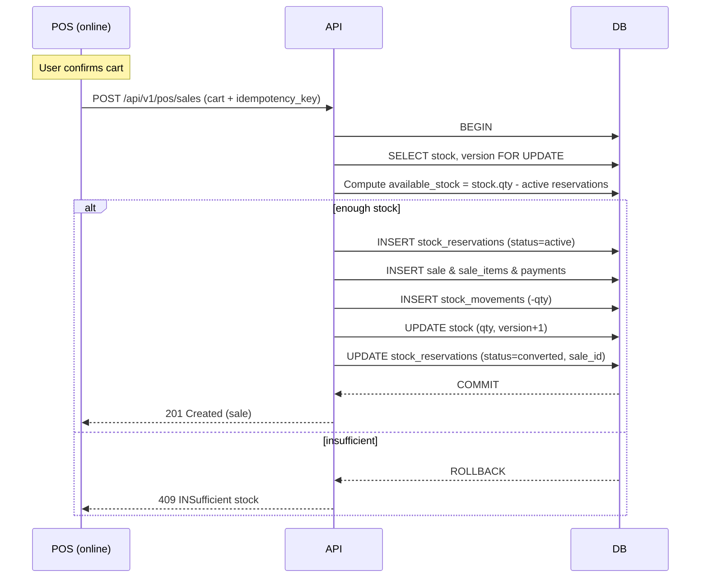
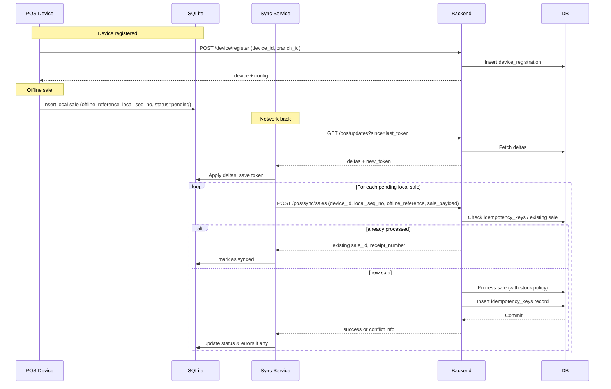

# EasyPOS – SaaS Production Readiness Upgrade

This document **extends** the existing architecture:

- Base architecture: [`ARCHITECTURE.md`](ARCHITECTURE.md:1)
- Backend spec: [`BACKEND_SPEC.md`](BACKEND_SPEC.md:1)
- DB schema: [`DB_SCHEMA.md`](DB_SCHEMA.md:1)
- Refinements: [`ARCHITECTURE_REVIEW.md`](ARCHITECTURE_REVIEW.md:1)

It specifies **final, production-grade decisions** for EasyPOS as a **multi-tenant SaaS POS**.

---

## 1. Architecture Strategy (Modular Monolith + ADRs)

### 1.1 Architectural Style

Decision:

- **Architectural pattern**: **Modular Monolith** with strict domain boundaries.
- Modules (same as in [`BACKEND_SPEC.md`](BACKEND_SPEC.md:34)):
  - `auth`, `users`, `rbac`, `tenants_vendors`, `catalog`, `inventory`, `purchasing`,
    `pos_sales`, `commissions`, `notifications`, `reports`, `ai_integration`, `audit`.

Rules:

- Each module has its own:
  - `domain/`, `application/`, `infrastructure/`, `presentation/` sub-tree.
- **No cross-module DB access**:
  - A module can only access another module via **application services interfaces**, not directly via ORM models of another module.
- Shared utilities (logging, config, messaging, HTTP client) live in `core/` and depend on no domain modules.

### 1.2 Module Interaction Rules

- Allowed communication:
  - `Module A (application layer)` → calls → `Module B (application service interface)`  
    implemented by B’s application layer or via a shared service.
- Forbidden:
  - `Module A` querying `Module B`’s tables directly via ORM.
  - `Module A` importing `Module B`’s internal DTOs/entities.

Example:

- `pos_sales` needs vendor/branch info:
  - It calls `tenants_vendors.GetBranchById()` application service.
- `purchasing` needs to check stock:
  - It calls `inventory.GetStockForProducts()` use case.

### 1.3 Future Microservice Extraction Strategy

When scale or organizational complexity require microservices:

- Candidates for extraction:
  - `ai_integration` → AI Forecasting microservice (already designed as external).
  - `notifications` → Notification worker service.
  - `reports` → Read-optimized reporting service.
- Strategy:
  - Maintain **module boundaries + domain events** inside monolith.
  - Extraction path:
    1. Convert in-process domain events into **message broker events**.
    2. Move module implementation into separate service that subscribes to these events.
    3. Keep API contracts stable for clients (mobile/web), fronted by API gateway or monolith façade.

### 1.4 Architecture Decision Records (ADR)

Create lightweight ADRs under:

- `docs/adr/ADR-XXXX-title.md`

Initial ADRs (must be written before coding):

1. `ADR-0001-modular-monolith.md`  
   - Decision: Modular monolith with strict domain boundaries, event-driven extensions, future extraction path.
2. `ADR-0002-stock-concurrency-policy.md`  
   - Decision: Hybrid optimistic locking + stock_reservations.
3. `ADR-0003-offline-sync-policy.md`  
   - Decision: Device registration, idempotency_keys, conflict rules.
4. `ADR-0004-multi-tenancy-model.md`  
   - Decision: Single DB multi-tenant with strong isolation at ORM + service layer.
5. `ADR-0005-background-jobs-and-queues.md`  
   - Decision: Single job system for async work with DLQ and idempotent handlers.

---

## 2. Advanced Concurrency & Stock Control

### 2.1 Optimistic Locking

Add `version` column to critical tables:

- `stock`:
  - `version` int not null default 0
- optionally `sales`, `purchase_orders`, `stock_adjustments` if needed for concurrent edit protection.

Update behavior:

- On stock modification:
  - `UPDATE stock SET quantity = ?, version = version + 1 WHERE id = ? AND version = ?`
  - If rows affected = 0 → **concurrency conflict** → retry with fresh data.

### 2.2 stock_reservations Table

Purpose: Reserve stock during the short window between:

- items added to cart, and
- sale committed (online POS only).

Schema:

```text
stock_reservations
-------------------
id              bigint/uuid PK
tenant_id       bigint/uuid NOT NULL FK → tenants.id
vendor_id       bigint/uuid NOT NULL FK → vendors.id
branch_id       bigint/uuid NOT NULL FK → branches.id
warehouse_id    bigint/uuid NOT NULL FK → warehouses.id
product_id      bigint/uuid NOT NULL FK → products.id
reserved_qty    decimal(18,4) NOT NULL (base units)
status          enum NOT NULL (active, released, converted)
sale_id         bigint/uuid NULL FK → sales.id
pos_terminal_id varchar(64) NOT NULL
expires_at      timestamp NOT NULL  (short TTL, e.g. 5–10 minutes)
created_at      timestamp NOT NULL
created_by      bigint/uuid NULL FK → users.id
```

Indexes:

- `index(warehouse_id, product_id, status)`
- `index(branch_id, product_id, status)`
- `index(expires_at, status)`

Usage:

- At cart confirmation (online):
  - Create `stock_reservations` entries per line and **subtract from available quantity** when showing stock to other sessions.
- On successful sale commit:
  - Mark related reservations `status = converted`, link `sale_id`.
  - `stock_movements` handle the real deduction.
- On cart cancel or timeout:
  - Mark reservations `status = released`.

### 2.3 Hybrid Stock Policy

Policy:

- **Online POS:**
  - Hard validation:
    - `available_stock = stock.quantity - active_reservations_total`
    - If `available_stock < requested_qty` → reject with `INSUFFICIENT_STOCK`.
- **Offline POS:**
  - Allow sale even if server-side stock would go negative.
  - At sync:
    - If applying offline sale causes stock to go negative:
      - Commit sale.
      - Set `stock_conflict_flag = true` on a new operational table:
        - `stock_conflicts(tenant_id, vendor_id, branch_id, product_id, sale_id, detected_at, resolved_at, resolution_notes)`.

### 2.4 Conflict Resolution Workflow

Workflow:

1. Background job reads `stock_conflicts` and unresolved negative stock.
2. For each conflict:
   - Notify branch manager (notification record + email/push).
   - Manager chooses:
     - Adjust stock up (physical count).
     - Mark discrepancy as loss (stock_adjustment).
3. Once resolved:
   - `resolved_at` and `resolution_notes` updated.
   - `stock` corrected via `stock_adjustments` + `stock_movements`.

### 2.5 Oversell Prevention under High Concurrency

- Online devices:
  - Use **optimistic locking on `stock`** + **stock_reservations**.
  - If concurrent update conflict happens:
    - Retry sale creation once with refreshed stock (see retry policy).

### 2.6 Retry Policy with Exponential Backoff

For POS sale creation (online) and stock updates:

- Client retries on:
  - 409 (conflict) or transient 5xx network errors.
- Policy:
  - Max 3 retries.
  - Backoff: 200ms, 400ms, 800ms (jitter optional).
- Server must stay **idempotent** with respect to:
  - `idempotency_keys` (see section 4).

### 2.7 Updated Flow (Online Sale with Reservation)



---

## 3. Enterprise Multi-Tenancy Hardening

### 3.1 Tenant Isolation Levels

Decisions:

1. **DB level**:
   - Single shared DB per environment.
   - All business data tables must include `tenant_id`.
   - Consider PostgreSQL RLS for high-security tenants, documented in `ADR-0004`.
2. **ORM level**:
   - Every query built through a **TenantScopedRepository** abstraction that:
     - Automatically injects `tenant_id` to WHERE clause and inserts.
3. **Service layer**:
   - All use cases receive `tenantContext` from auth middleware, not from controllers.

### 3.2 Composite Index Strategy

- Heavy multi-tenant tables (`sales`, `stock`, `stock_movements`, `product_daily_sales`) must have indexes that start with `tenant_id`:

Examples:

- `sales (tenant_id, vendor_id, branch_id, sale_datetime)`
- `stock (tenant_id, warehouse_id, product_id)`
- `stock_movements (tenant_id, warehouse_id, product_id, created_at)`
- `product_daily_sales (tenant_id, branch_id, product_id, sales_date)`

### 3.3 Row Filtering Guard Pattern

Implement a guard in the infrastructure layer:

- `TenantScopedRepository` wrapper:

  - For any `findById(id)` variant:
    - It internally adds `AND tenant_id = :tenant_id`.
  - For any list/filter:
    - It **always merges** provided filters with `{ tenant_id: currentTenant }`.

Controllers **never** pass tenant_id to repositories directly.

### 3.4 Tenant Onboarding Lifecycle

Steps:

1. Admin creates new tenant record (`tenants`).
2. System generates:
   - Default roles and permissions for tenant.
   - Initial `vendor` for that tenant (if 1:1).
   - Default `branch` and `warehouse`.
3. Initial admin user is created and invited (email or link).

### 3.5 Tenant Offboarding & Data Retention

Decision:

- Offboarding flows:
  - Tenant set to `status = inactive`.
  - All users disabled.
  - Data retention:
    - Keep all transactional data for **X years** (configurable; default 5) or as per contract; marked with retention policy.
- Optional:
  - Logical deletion: `deleted_at` on `tenants`, keep data but block logins.
  - Physical deletion:
    - Only after retention period and **explicit approval**.

---

## 4. Offline Industrial-Grade Design

### 4.1 New Tables

#### 4.1.1 device_registration

Tracks POS devices per tenant/branch.

```text
device_registration
-------------------
id              bigint/uuid PK
tenant_id       bigint/uuid NOT NULL FK → tenants.id
vendor_id       bigint/uuid NOT NULL FK → vendors.id
branch_id       bigint/uuid NOT NULL FK → branches.id
device_id       varchar(128) NOT NULL  -- hardware / logical ID
pos_terminal_id varchar(64)  NOT NULL  -- short ID used in app
status          enum NOT NULL (active, blocked, retired)
last_seen_at    timestamp NULL
registered_at   timestamp NOT NULL
registered_by   bigint/uuid NULL FK → users.id
```

Indexes:

- `unique(tenant_id, device_id)`
- `unique(tenant_id, branch_id, pos_terminal_id)`

#### 4.1.2 idempotency_keys

Central idempotency store for critical POST endpoints.

```text
idempotency_keys
----------------
id                bigint/uuid PK
tenant_id         bigint/uuid NOT NULL FK → tenants.id
key               varchar(128) NOT NULL   -- from client header or body
endpoint          varchar(128) NOT NULL   -- normalized route
request_hash      varchar(128) NOT NULL   -- hash of body
response_body     jsonb         NULL      -- last successful response
status            enum NOT NULL (pending, completed, failed)
created_at        timestamp NOT NULL
expires_at        timestamp NOT NULL
```

Indexes:

- `unique(tenant_id, endpoint, key)`

### 4.2 Local Sequence Number

Each POS device maintains **monotonic local sequence per terminal**:

- For each offline sale:
  - `local_sequence_number` incremented locally.
  - Payload to backend includes:
    - `device_id`
    - `pos_terminal_id`
    - `local_sequence_number`
    - `offline_reference` (UUID)

Backend uses `(tenant_id, device_id, local_sequence_number)` as **strong idempotency key**.

### 4.3 Duplicate Detection Logic

- On `/pos/sync/sales`:
  - Check `idempotency_keys` or `sales` for:
    - `(tenant_id, branch_id, pos_terminal_id, offline_reference)` or
    - `(tenant_id, device_id, local_sequence_number)`.
  - If found:
    - Return existing sale result (idempotent).
  - Else:
    - Process sale and insert record into `idempotency_keys`.

### 4.4 Sync Conflict Resolution Rules (Summary)

- `PRICE_MISMATCH`:
  - Accept sale at client price but record discrepancy in `audit_logs` + `stock_conflicts` (detail reason).
- `PRODUCT_INACTIVE`:
  - Reject that sale item, mark overall sale as `error` for operator review.
- `INSUFFICIENT_STOCK`:
  - For offline:
    - Commit sale, register `stock_conflicts` entry.
  - For online:
    - Reject.

### 4.5 POS Bootstrap Optimization Strategy

- `/pos/bootstrap` returns:
  - Only **delta** changes if a `last_sync_token` is provided.
  - Large catalogs:
    - Use **paging + hash/versioning of product lists** to avoid full refetch.
- Data structures:
  - Use compact payloads: product fields minimized, numeric IDs only, avoid nested heavy structures.

### 4.6 Sync Flow Diagram (Offline, Industrial-grade)



### 4.7 Failure Case Handling Table (High-level)

| Case                                      | Behavior                                                                 | Client Action                          |
|-------------------------------------------|--------------------------------------------------------------------------|----------------------------------------|
| Network down during sync                  | Local queue stays `pending`                                             | Retry later automatically              |
| 409 conflict (online)                     | Do not commit sale, show out-of-stock to cashier                        | Ask user to adjust cart                |
| 409 conflict (offline sync)               | Commit sale, log `stock_conflicts` entry                                | Mark sale synced + show conflict flag  |
| Duplicate offline sale                    | Server returns existing sale; local marks as `synced`                   | No UI error                            |
| Validation error (invalid product, etc.)  | Mark local sale as `error` with message                                 | Show to manager for manual resolution  |

---

## 5. Database Scalability Plan

### 5.1 Monthly Partitioning (Sales & Stock Movements)

For PostgreSQL-style approach:

- Partition `sales`, `sale_items`, `stock_movements`, `product_daily_sales`, `audit_logs` by **month** on date columns (`sale_datetime`, `created_at`, `sales_date`).
- Naming:
  - `sales_2026_01`, `sales_2026_02`, etc.

Benefits:

- Faster queries for recent months.
- Easier archiving and vacuuming.

### 5.2 Index Strategy per Heavy Table

- `sales`:
  - Partition key: `sale_datetime`
  - Indexes:
    - `(tenant_id, branch_id, sale_datetime)`
    - `(tenant_id, vendor_id, sale_datetime)`
    - `(branch_id, receipt_number)` unique
- `stock_movements`:
  - Partition key: `created_at`
  - Indexes:
    - `(tenant_id, warehouse_id, product_id, created_at)`
    - `(tenant_id, source_type, source_id)`
- `audit_logs`:
  - Partition key: `created_at`
  - Indexes:
    - `(tenant_id, entity_type, entity_id, created_at)`
    - `(user_id, created_at)`

### 5.3 Archiving Strategy

- Move closed historical partitions (e.g. older than 2 years) to:
  - Cheaper storage or archive DB.
- POS and main admin UI:
  - Query non-archived partitions by default.
- Dedicated reporting service:
  - Can read archived data if needed.

### 5.4 Read Replica Strategy

- Use at least **one read replica** per environment for:
  - Reporting queries.
  - AI aggregation jobs.
- Main write DB:
  - Handles OLTP (POS, POs, stock changes).
- Read replicas:
  - Serve `/reports/*` and `/forecast/run` data fetch, with read-after-write delay acceptable.

### 5.5 Estimated Scaling Limits (Rough)

Assuming:

- Single good RDBMS node and tuned indexes:

- Up to **1M sales**:
  - Single DB, minimal partitioning, one replica is fine.
- Around **5M–10M sales**:
  - Monthly partitioning strongly recommended.
  - Read replicas for reporting and forecasting mandatory.
- Beyond **10M sales/year**:
  - Consider:
    - Horizontal scaling for reporting (`reports` service with separate DB).
    - Further denormalization and OLAP stores for BI.

---

## 6. Background Job System

### 6.1 Job Queue Architecture

- Use a dedicated job queue (e.g. Redis-based, RabbitMQ, or managed service).
- Components:
  - `job_producer` in API.
  - `job_worker` service.

Job table (if DB-backed):

```text
jobs
----
id           bigint/uuid PK
type         varchar(64) NOT NULL
payload      jsonb       NOT NULL
status       enum        NOT NULL (pending, processing, completed, failed, dead_letter)
attempts     int         NOT NULL DEFAULT 0
max_attempts int         NOT NULL DEFAULT 5
next_run_at  timestamp   NOT NULL
created_at   timestamp   NOT NULL
updated_at   timestamp   NOT NULL
```

### 6.2 Retry Strategy & DLQ

- Retries:
  - Exponential backoff based on `attempts`.
- After `max_attempts`:
  - Move job to **Dead Letter Queue** (DLQ) or mark `status = dead_letter`.
- DLQ jobs:
  - Visible to operators for manual resolution or replay.

### 6.3 Idempotent Job Handling

- Each job must have **business idempotency key**:
  - E.g., `forecast_job (tenant_id, date_range)` or `notification_key`.
- Handlers check if job effect already applied before redoing work.

### 6.4 Critical vs Non-Critical Jobs

- Critical:
  - `SaleCompleted` projections into `product_daily_sales`.
  - `StockConflict` notifications.
- Non-critical:
  - Email reports, exports, some notifications, AI retraining jobs.

Critical jobs:

- Must be retried and monitored closely; failure should raise alerts.

### 6.5 AI Forecasting as Async Batch

- Forecast jobs:
  - Triggered nightly or on demand:
    - Job payload: tenant/vendor, branch list, horizon_days.
  - Worker:
    - Fetches data from read replicas or `product_daily_sales`.
    - Calls AI microservice.
    - Stores `forecast_results`.

---

## 7. Security Hardening

### 7.1 Refresh Token Rotation

- On each refresh:
  - Issue **new refresh token**, invalidate old one.
- Store active refresh tokens (hashed) per user in DB:
  - (`user_id`, `refresh_token_hash`, `expires_at`, `device_id`).
- Re-use of old refresh token after rotation:
  - Treat as **suspicious**, revoke session.

### 7.2 Rate Limiting

- Apply per-IP and per-tenant rate limits especially on:
  - Auth endpoints (login, refresh).
  - POS endpoints (`/pos/sales`, `/pos/sync/sales`).
- Implement token bucket or sliding window.

### 7.3 Account Lock Policy

- After N failed login attempts (e.g., 5 attempts in 10 minutes):
  - Lock account for short period (e.g., 15 minutes).
- Provide secure unlock/reset flow for admins.

### 7.4 Permission Versioning

- `permissions_version` claim already noted.
- On any role/permission change:
  - Increment `permissions_version` for affected user.
  - JWTs with old version considered invalid for privileged operations.

### 7.5 Strict RBAC Enforcement Model

- For all high-risk endpoints:
  - Enforce both:
    - Permission codes (`rbac.manage_roles`, `pricing.update`, `inventory.adjust`, `purchasing.approve`).
    - Role constraints (only ADMIN can grant certain permissions).
- Hard rule:
  - No endpoint allows changing own roles/permissions unless global ADMIN with explicit permission.

### 7.6 Audit Policy

Minimum audit coverage:

- Log **who did what and when** for:
  - Auth (logins, failed login, password resets).
  - RBAC changes.
  - Product create/update/delete.
  - Price changes.
  - Stock adjustments.
  - Sales creation, void, refund.
  - POs approvals, receiving, cancellations.

Use `audit_logs` as defined and ensure sensitive values (passwords, tokens) never logged.

### 7.7 Threat Model Summary

- Data leakage:
  - Mitigated by tenant_id scoping, optional RLS, strong auth, encryption of data at rest and in transit.
- Privilege escalation:
  - Mitigated by strict RBAC, role edit controls, permission versioning, audits.
- Replay attacks:
  - Mitigated by short-lived access tokens, rotated refresh tokens, idempotency keys.
- Multi-tenant boundary breaches:
  - Mitigated by TenantScopedRepository guard, tenant_id enforcement from JWT, and optional RLS.

---

## 8. Observability & Operations

### 8.1 Structured Logging Format

- JSON logs with fields:
  - `timestamp`, `level`, `message`, `tenant_id`, `user_id`, `branch_id`, `device_id`, `correlation_id`, `request_id`, `endpoint`, `status_code`, `latency_ms`.

### 8.2 Correlation ID Propagation

- Each incoming request:
  - If header `X-Correlation-Id` exists → use it.
  - Else → generate UUID.
- Propagate correlation ID:
  - To downstream services (AI, notification).
  - Into logs and job payloads.

### 8.3 Metrics List

At minimum:

- `pos_request_latency_ms` (by endpoint, tenant, branch).
- `pos_request_error_rate` (by endpoint).
- `offline_sync_failure_rate` (number of failed sales per sync).
- `stock_conflict_rate` (number of conflicts per 1,000 sales).
- `db_query_latency` (slow query tracking).
- `job_failure_rate` (per job type).

### 8.4 Alerting Strategy

Alerts when:

- POS latency (p95) > SLA threshold (e.g., 300ms) for sustained periods.
- Sync failure or stock conflict rate spikes above configured threshold.
- DB slow queries > threshold count.
- Job failure rate > X% or DLQ size > threshold.
- Auth failure spike (possible attack).

### 8.5 SLA Targets

- POS core endpoints:
  - Availability: **99.9%**
  - Latency p95: **< 300ms** under normal load.
- Sync endpoints:
  - Availability: **99.5%**
- Support:
  - Time to detect critical incident: < 5 minutes via alerts.

---

## 9. Production Readiness Checklist

### 9.1 Go-Live Checklist (High-Level)

- [ ] All ADRs created and agreed.
- [ ] Stock concurrency policy implemented & tested (happy path + conflicts).
- [ ] Offline sync tested with:
  - Single device.
  - Multiple devices per branch.
  - Concurrency + conflict scenarios.
- [ ] RBAC:
  - Roles and permissions seeded and verified.
  - High-privilege endpoints locked.
- [ ] Multi-tenant isolation tests:
  - Automated tests ensure no cross-tenant access.
- [ ] Observability:
  - Logs, metrics, dashboards, alerts in place.
- [ ] Backup & restore tested on staging.
- [ ] Runbook for incidents documented.
- [ ] Performance tests:
  - Load tested to target scale (branches/devices/sales volume).

### 9.2 Risk Matrix (Sample)

| Risk                                         | Impact | Likelihood | Level  | Mitigation                                      |
|----------------------------------------------|--------|------------|--------|-------------------------------------------------|
| Stock inconsistency under concurrency        | High   | Medium     | High   | Optimistic locking + reservations + conflicts   |
| Tenant data leak                             | High   | Low        | High   | TenantScopedRepo, RLS, tests                    |
| Offline sync bugs causing duplicate sales    | Medium | Medium     | Medium | Idempotency keys + device seq numbers           |
| DB performance degradation over time         | High   | Medium     | High   | Partitioning, indexing, archiving, replicas     |
| Misconfigured RBAC leading to privilege gain | High   | Low        | High   | Strict RBAC policy + audits                     |
| Missing observability                        | High   | Medium     | High   | Metrics, dashboards, alerts                     |
| Forecasting job overload                     | Medium | Low        | Low    | Run on replicas, schedule windows, job limits   |
| Backup restore failure                       | High   | Low        | High   | Regular restore drills                          |
| Queue backlog affecting critical jobs        | Medium | Medium     | Medium | Dedicated workers, priority queues              |
| Regulatory non-compliance                    | High   | Low        | High   | Audit coverage, retention policies              |

### 9.3 Rollback Strategy

- App deployments:
  - Use blue-green or canary deployments.
  - Maintain last **N** releases for quick rollback.
- DB schema:
  - Avoid destructive migrations near go-live.
  - Use **backwards-compatible changes first**, then code rollout, then cleanup later.
- In case of severe production issue:
  - Option 1: Rollback app version while keeping DB forward-compatible.
  - Option 2: Activate read-only mode for POS while investigation runs.

### 9.4 Backup & Restore Strategy

- Full backups:
  - Daily full backups + WAL/transaction logs.
- Retention:
  - Configurable per environment (e.g., 30–90 days).
- Restore:
  - Periodic **restore drills** to test RPO/RTO compliance.
- Tenant-level restore:
  - Optionally:
    - Implement tenant-level export/import to restore a single tenant from backup if required.

---

This document, together with:

- [`ARCHITECTURE.md`](ARCHITECTURE.md:1)
- [`DB_SCHEMA.md`](DB_SCHEMA.md:1)
- [`BACKEND_SPEC.md`](BACKEND_SPEC.md:1)
- [`ARCHITECTURE_REVIEW.md`](ARCHITECTURE_REVIEW.md:1)

forms the **SaaS-ready, production-grade blueprint** for EasyPOS. All implementation teams must treat these decisions as constraints, not suggestions.